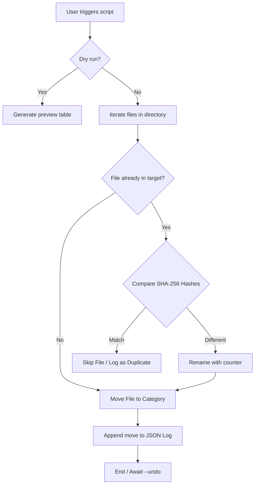

Here is a professional, portfolio-ready `README.md` that highlights both the functionality of your tool and the solid software engineering principles (hashing, state management, testing) behind it.

You can copy and paste the text below directly into a `README.md` file in your repository.

---

```markdown
# Smart File Organizer 📂✨

A robust, zero-dependency command-line utility that intelligently declutters directories. Built with file safety as a priority, it features SHA-256 duplicate detection, dry-run previews, and a state-managed undo system to ensure you never lose or misplace data.


*(**Portfolio Note:** Add a GIF here showing the CLI in action using a tool like [Terminalizer](https://terminalizer.com/) or [VHS](https://github.com/charmbracelet/vhs))*

## 🚀 Features

* **Intelligent Deduplication:** Uses cryptographic `SHA-256` hashing to detect true file duplicates, regardless of their filenames. 
* **State-Managed Undo:** Every execution writes a temporary `.organizer_log.json`. If you make a mistake, simply run the `--undo` command to reverse all file movements and clean up empty folders.
* **Dry-Run Previews:** Preview exactly where files will go and which duplicates will be skipped without making a single change to your disk.
* **Zero Core Dependencies:** The main script is built entirely using the Python Standard Library (`pathlib`, `hashlib`, `json`, `shutil`).
* **Chronological Sorting:** Optional `--by-date` flag sorts files into `Year/Month` subdirectories based on system modification timestamps.

## 🧠 Architecture Flow



## 🛠️ Installation

Because the core script relies purely on standard Python libraries, installation is instant.

```bash
# Clone the repository
git clone [https://github.com/yourusername/smart-file-organizer.git](https://github.com/yourusername/smart-file-organizer.git)
cd smart-file-organizer

# Run the script directly
python smart_organizer.py --help

```

## 💻 Usage

The CLI is designed to be intuitive and highly readable, outputting aligned tables with status indicators.

**1. Preview changes (Safe mode)**
See what will happen without actually moving anything:

```bash
python smart_organizer.py ~/Downloads --dry-run

```

**2. Standard Organize**
Move files into category folders (Images, Documents, Code, etc.):

```bash
python smart_organizer.py ~/Downloads

```

**3. Organize by Date**
Create chronological subfolders inside the category folders (e.g., `Images/2026/09-September/`):

```bash
python smart_organizer.py ~/Downloads --by-date

```

**4. Keep Duplicates**
By default, identical files are skipped. Use this flag to keep them (they will be renamed with numerical suffixes):

```bash
python smart_organizer.py ~/Downloads --keep-dupes

```

**5. Undo Last Operation**
Made a mistake? Reverse the last run based on the JSON state log:

```bash
python smart_organizer.py ~/Downloads --undo

```

## 🧪 Testing

This project includes a comprehensive test suite covering file categorization, hash logic, duplicate skipping, and undo state reversal. Tests are executed in isolated, temporary directories using `pytest`.

To run the tests:

```bash
# Install the testing framework
pip install pytest

# Run the test suite
pytest test_smart_organizer.py -v

```

## 📄 License

This project is open-source and available under the [MIT License](https://www.google.com/search?q=LICENSE&utm_source=gemini).

```

***

### Next Steps before you push to GitHub:
1. Copy the text block above into a file named `README.md`.
2. Replace `yourusername` in the clone link with your actual GitHub username.
3. Replace the `*(Portfolio Note...)*` line with an actual GIF of your script running. Let me know if you need help generating one!

```